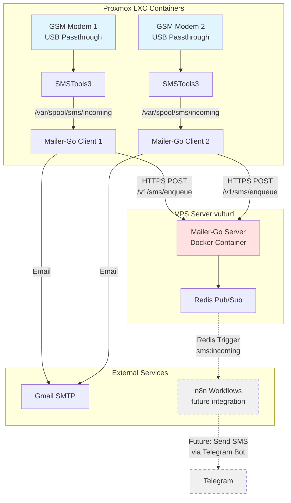
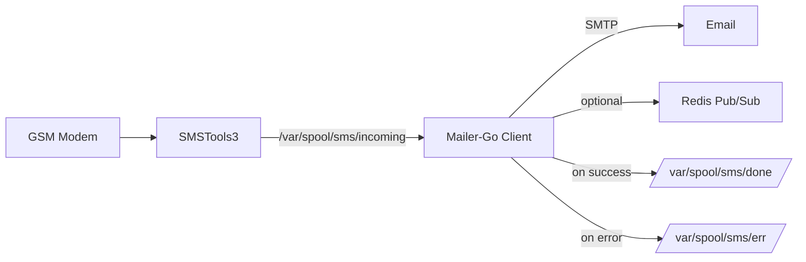
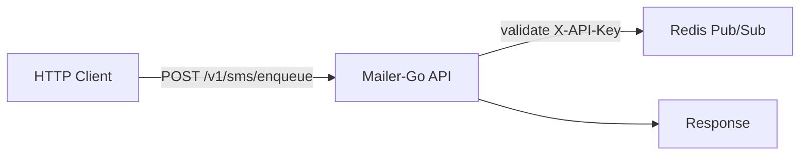

# Mailer-Go

SMS-to-Email gateway for GSM modems running on LXC containers.

## What's This About?

This is my personal solution to receive SMS from anywhere in the world without paying crazy roaming charges or dealing with VPN complexity. I use it daily to get authentication codes, notifications, and messages while traveling or working remotely.

**Disclaimer**: This code was built fast and pragmatically - no tests, no fancy patterns, just working code that does the job lol. If it works, it works.

## Why LXC Containers?

Initially tried connecting the GSM modems through VPNs (WireGuard, ZeroTier, you name it...) to transport the data back home. **Lesson learned**: It's a PITA. VPN tunnels add latency, drop connections, require complex routing, and honestly it's overkill for this use case.

**Solution**: LXC containers running directly on Proxmox with USB passthrough. Why?
- **Simple**: Modem plugs directly into container via USB passthrough
- **Isolated**: Each modem gets its own container, no interference (Don't ask me how I realized this after having a VM crashing and me just entering the virtualizer just to restart the VM and hope that the OTP message reaches my mail in time)
- **Lightweight**: LXC is way lighter than full VMs
- **Direct access**: No network tunneling, no VPN overhead
- **Easy debugging**: SSH into container, check logs, restart service

Instead of fighting with VPN routing, I just built a tiny Go microservice that receives the SMS data over HTTPS and publishes to Redis. Way simpler, more reliable, and easier to maintain.

## Architecture

### Full System Diagram



### Components

- **SMSTools3** - SMS gateway daemon that reads from GSM modems and writes to filesystem
- **Mailer-Go (Client Mode)** - File watcher daemon that processes SMS files and sends emails
- **Mailer-Go (Server Mode)** - HTTP API server that receives SMS and publishes to Redis
- **Redis Pub/Sub** - Message bus for real-time SMS distribution (n8n reads from here)

### How It Works

1. **LXC Containers** (on Proxmox) have GSM modems attached via USB passthrough
2. **SMSTools3** detects incoming SMS and writes them to `/var/spool/sms/incoming`
3. **Mailer-Go Client** watches that folder, parses the SMS, and:
   - Sends you an email via Gmail (immediate notification)
   - POSTs the SMS to the HTTP server on vultur1
4. **Mailer-Go Server** validates the API key and publishes to Redis Pub/Sub channel `sms:incoming`
5. **n8n** (future) subscribes to that Redis channel and can trigger workflows:
   - Forward to Telegram
   - Store in database
   - Send SMS replies (when I get around to implementing that lol)

### Data Flow

#### File Watcher Mode (Primary Deployment)



The file watcher daemon monitors the incoming SMS directory for new files created by SMSTools3. When a file appears, it parses the SMSTools3 format, sends an email via Gmail SMTP, optionally publishes the message to a Redis channel for real-time distribution, and moves the processed file to the done directory. Failed messages are moved to the error directory.

#### Server Mode (HTTP API)



The HTTP server provides an API endpoint for enqueueing SMS messages. It validates the API key from the request header, publishes messages to Redis channels for real-time distribution, and includes a health check endpoint for monitoring.

### Project Structure

```
mailer-go/
├── cmd/
│   ├── mailer/          # File watcher daemon (client mode)
│   │   ├── main.go       # Main entry point
│   │   └── config.yaml   # Example configuration
│   └── server/          # HTTP API server (server mode)
│       └── main.go       # Main entry point
├── pkg/
│   ├── config/          # Configuration management
│   │   └── config.go    # Config struct and loading logic
│   ├── errors/          # Error definitions
│   │   └── errors.go
│   ├── mailer/          # Core SMS processing logic
│   │   ├── mailer.go    # Email sending, SMS parsing, Redis publishing
│   │   └── client.go    # HTTP client for server communication
│   └── server/          # HTTP server implementation
│       └── server.go    # API handlers, auth middleware
├── config/              # Configuration files
├── fs/                  # Filesystem directories (inbox, err, done)
├── docker-compose.yaml  # Container orchestration
├── Dockerfile           # Image build definition
└── Makefile            # Build automation
```

### Application Stereotypes

- **File Watcher Daemon** (`cmd/mailer/main.go`): Long-running process, filesystem monitoring, sequential processing
- **HTTP Server** (`cmd/server/main.go`): Stateless API server, authentication middleware, pub/sub producer
- **SMS Parser** (`pkg/mailer/mailer.go`): Message transformation, format conversion, external integration
- **HTTP Client** (`pkg/mailer/client.go`): Remote service communication, retry logic (implicit)
- **Configuration Manager** (`pkg/config/config.go`): Centralized config, environment variable binding, validation

## Current Status & Future Plans

### What Works Today

- Receive SMS from GSM modems anywhere in the world
- Get instant email notifications
- Publish to Redis Pub/Sub for real-time processing
- Structured JSON messages with proper parsing
- HTTP API for remote SMS submission

### Roadmap (When I Have Time)

**Phase 1: n8n Integration** (separate project, coming soon)
- n8n reads from `sms:incoming` Redis channel using Redis Trigger node
- Forward SMS to Telegram bot
- Store messages in database for history
- Custom automation workflows (filter by sender, keyword triggers, etc.)

**Phase 2: Two-Way SMS** (future)
- Send SMS from Telegram via n8n webhook
- API endpoint: `POST /v1/sms/send`
- Write to SMSTools3 outgoing queue
- Track delivery status

**Phase 3: Maybe Someday**
- Web UI for SMS history
- Better error handling (right now it just logs and moves on lol)
- Actually write some tests (I know, I know...)
- Prometheus metrics maybe?

## Deployment

The system runs across multiple hosts:

**Client Side** (Proxmox LXC):
- Two LXC containers (gsm-modem-1, gsm-modem-2)
- Each container has USB passthrough for one GSM modem
- Containers run on local network (192.168.31.0/24 subnet)
- Native Golang binary (no Docker, learned that AppArmor in LXC is a pain)

**Server Side** (VPS vultur1):
- Docker container running the HTTP API
- Connected to Redis on internal Docker network
- Exposed via Traefik reverse proxy with HTTPS
- API endpoint: `https://mailer-go.vultur.josnelihurt.me`

Each LXC container handles one modem independently with identical configuration.

## Hardware

- Huawei GSM Modem (12d1:1c10) - IMEI: XXXXXXXXXXXXXXX
- Huawei GSM Modem (12d1:1c05) - IMEI: XXXXXXXXXXXXXXY

## Dependencies

### System Level
- SMSTools3 (v3.1.21) - SMS gateway daemon
- Docker (docker.io)
- udev rules for persistent device naming

### Application
- Go application (containerized)
- Docker image: `josnelihurt/mailer-go:latest`

### Configuration Files

**Application** (`config.yaml`):
- `email` - Gmail SMTP account
- `password` - App-specific password
- `recipient_email` - Destination email addresses (list)
- `inbox_folder` - SMS input directory
- `err_folder` - Failed SMS directory
- `done_folder` - Processed SMS directory
- `redis_enabled` - Enable Redis pub/sub
- `redis_host` - Redis server hostname
- `redis_port` - Redis server port
- `imei_to_phone` - Map of IMEI to phone numbers for email subject generation
- `server_url` - HTTP API server URL for client mode
- `api_key` - API key for authenticating with server

**SMSTools3** (`/etc/smsd.conf`):
- Device configuration (ttyUSB0, baudrate)
- Incoming/outgoing folder paths
- Log file paths

## Deployment Scripts

Infrastructure provisioning:
```bash
./scripts/prox2/deploy_gsm_modems.sh
```

Application deployment:
```bash
./scripts/prox2/deploy_mailer_go.sh
```

## Network

Both containers use host networking (network_mode: host) on the 192.168.31.0/24 subnet.

## SMS Message Format

SMSTools3 writes files in key-value format:

```
From: +1234567890
From_TOA: 91
From_SMSC: +1234567890
Sent: 25-12-25 14:30:00
Received: 25-12-25 14:30:05
Subject: [optional subject]
Modem: GSM1
IMSI: 123456789012345
IMEI: 355270044616142
Report: yes
Alphabet: UCS2
Length: 160
Message body text here
```

Parsed JSON structure includes all fields plus:
- `smstools_file`: Raw file content for fallback parsing

## Environment Variables

**Server Mode**:
- `SERVER_MODE=true` - Enable server mode
- `API_KEY` - Required authentication key for client requests (can also use `api_key` in config.yaml)

## API Endpoints

### POST /v1/sms/enqueue

Enqueue SMS message for distribution via Redis.

**Headers:**
- `Content-Type: application/json`
- `X-API-Key: <your-api-key>`

**Request Body:**
```json
{
  "sms_message": {
    "from": "+1234567890",
    "sent": "25-12-25 14:30:00",
    "message": "Hello world",
    "imei": "355270044616111",
    ...
  },
  "folder_name": "incoming"
}
```

**Response:**
- 200 OK: `{"status":"ok"}`
- 401 Unauthorized: Invalid API key
- 400 Bad Request: Invalid JSON or missing folder_name

### GET /health

Health check endpoint.

**Response:**
- 200 OK: `OK`

## Redis Channels

When `redis_enabled: true`, SMS messages are published to:

- Channel: `sms:<folder_name>` (e.g., `sms:incoming`)
- Payload: JSON-encoded SMS message with all fields
- Publish timeout: 3 seconds
- Connection timeout: 5 seconds
- Heartbeat key: `mailer-go:started` (startup timestamp)

## Error Handling

- Email send failure: Logged, continues to process
- Server enqueue failure: Logged, continues to process
- File move failure: Logged, file may remain in inbox
- Redis connection failure: Non-fatal, logged
- Malformed SMS: Raw content preserved in `smstools_file` field
- Missing folders: Fatal error at startup
- Missing config: Fatal error at startup

## Development

### Build

Build client (file watcher mode):
```bash
make build-client
```

Build server (HTTP API mode):
```bash
make build-server
```

Build both:
```bash
make build-all
```

Or manually:
```bash
go build -o bin/mailer-client cmd/mailer/main.go
go build -o bin/mailer-server cmd/server/main.go
```

### Run Locally

Client mode (file watcher):
```bash
./bin/mailer-client
```

Server mode (HTTP API):
```bash
export SERVER_MODE=true
export API_KEY=your-secret-key
./bin/mailer-server
```

### Docker Build
```bash
make docker-build
```

### Docker Run
```bash
docker-compose up -d
```
