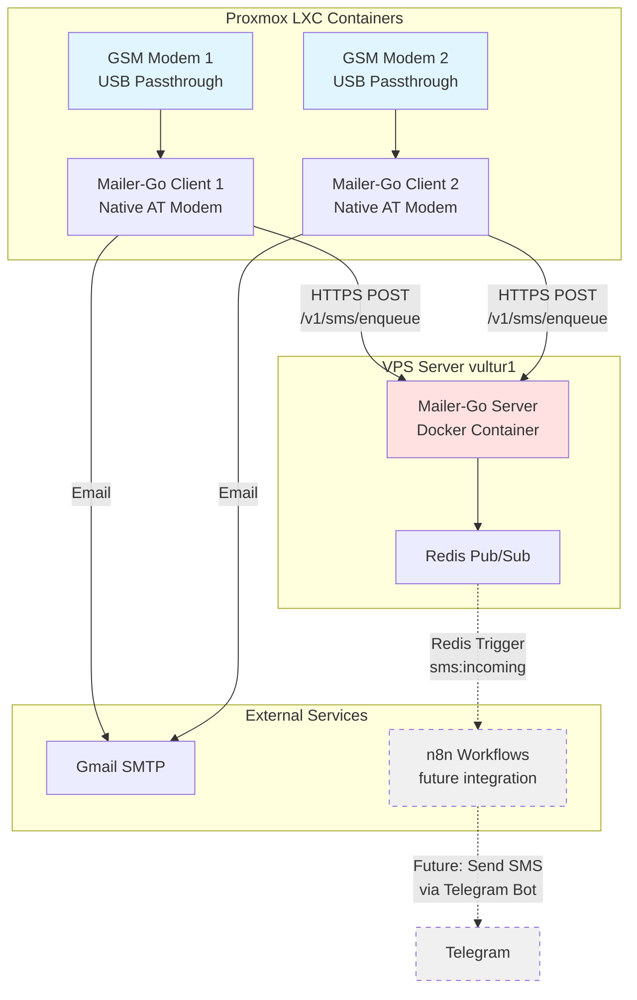
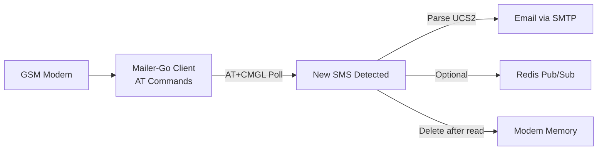
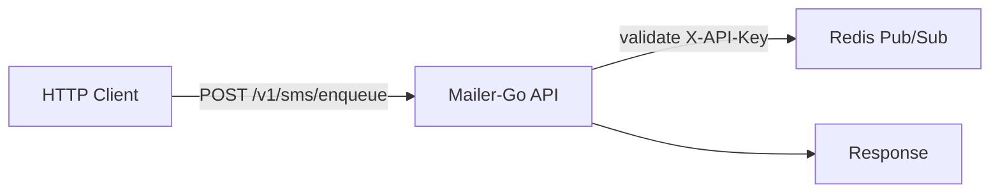

# Mailer-Go

SMS-to-Email gateway for GSM modems running on LXC containers with native AT modem communication.

## What's This About?

This is my personal solution to receive SMS from anywhere in the world without paying crazy roaming charges or dealing with VPN complexity. I use it daily to get authentication codes, notifications, and messages while traveling or working remotely.

**Disclaimer**: This code was built fast and pragmatically - no tests, no fancy patterns, just working code that does the job lol. If it works, it works.

## Why LXC Containers?

Initially tried connecting the GSM modems through VPNs (WireGuard, ZeroTier, you name it...) to transport the data back home. **Lesson learned**: It's a PITA. VPN tunnels add latency, drop connections, require complex routing, and honestly it's overkill for this use case.

**Solution**: LXC containers running directly on Proxmox with USB passthrough. Why?
- **Simple**: Modem plugs directly into container via USB passthrough
- **Isolated**: Each modem gets its own container, no interference (Don't ask me how I realized this after having a VM crashing and me just entering the virtualizer just to restart the VM and hope that the OTP message reaches my mail in time)
- **Lightweight**: LXC is way lighter than full VMs
- **Direct access**: No network tunneling, no VPN overhead
- **Easy debugging**: SSH into container, check logs, restart service

Instead of fighting with VPN routing, I just built a tiny Go microservice that receives the SMS data over HTTPS and publishes to Redis. Way simpler, more reliable, and easier to maintain.

## Architecture

### Full System Diagram



### Components

- **Mailer-Go (Client Mode)** - Native GSM modem communication using tarm/serial
- **Mailer-Go (Server Mode)** - HTTP API server that receives SMS and publishes to Redis
- **Redis Pub/Sub** - Message bus for real-time SMS distribution (n8n reads from here)

### How It Works

1. **LXC Containers** (on Proxmox) have GSM modems attached via USB passthrough
2. **Mailer-Go Client** communicates directly with the modem via AT commands:
   - Sends AT commands to check for new SMS (polls every 5 seconds)
   - Parses SMS from GSM modem using AT+CMGL
   - Sends you an email via Gmail (immediate notification)
   - POSTs the SMS to the HTTP server on vultur1
3. **Mailer-Go Server** validates the API key and publishes to Redis Pub/Sub channel `sms:incoming`
4. **n8n** (future) subscribes to that Redis channel and can trigger workflows:
   - Forward to Telegram
   - Store in database
   - Send SMS replies (when I get around to implementing that lol)

### Data Flow



The client polls the GSM modem every 5 seconds using AT+CMGL command to check for new messages. When new SMS are detected, it parses the UCS2-encoded content (both phone numbers and message text), sends an email via Gmail SMTP, optionally publishes the message to a Redis channel for real-time distribution, and deletes the message from modem memory if configured.

#### Server Mode (HTTP API)



The HTTP server provides an API endpoint for enqueueing SMS messages. It validates the API key from the request header, publishes messages to Redis channels for real-time distribution, and includes a health check endpoint for monitoring.

### Project Structure

```
mailer-go/
├── cmd/
│   ├── mailer/          # GSM modem client (native AT mode)
│   │   ├── main.go       # Main entry point
│   │   └── config.yaml   # Example configuration
│   └── server/          # HTTP API server (server mode)
│       └── main.go       # Main entry point
├── pkg/
│   ├── config/          # Configuration management
│   │   └── config.go    # Config struct and loading logic
│   ├── mailer/          # Core SMS processing logic
│   │   ├── gsm_modem.go # Native AT modem implementation
│   │   ├── email.go     # Email sending
│   │   ├── redis.go     # Redis publishing
│   │   ├── models.go    # SMS message structures
│   │   └── client.go    # HTTP client for server communication
│   └── server/          # HTTP server implementation
│       └── server.go    # API handlers, auth middleware
├── config/              # Configuration files
├── systemd/             # systemd service templates
├── docker-compose.yaml  # Container orchestration
├── Dockerfile           # Image build definition
└── Makefile            # Build automation
```

### Application Stereotypes

- **GSM Modem Client** (`cmd/mailer/main.go`): Long-running process, AT command polling, SMS parsing
- **HTTP Server** (`cmd/server/main.go`): Stateless API server, authentication middleware, pub/sub producer
- **GSM Modem Driver** (`pkg/mailer/gsm_modem.go`): AT command handling, UCS2 decoding, message parsing
- **HTTP Client** (`pkg/mailer/client.go`): Remote service communication
- **Configuration Manager** (`pkg/config/config.go`): Centralized config, environment variable binding, validation

## Current Status & Future Plans

### What Works Today

- Native GSM modem communication via AT commands (no SMSTools3 dependency)
- Receive SMS from GSM modems anywhere in the world
- UCS2 hex decoding for international phone numbers and text
- Get instant email notifications
- Publish to Redis Pub/Sub for real-time processing
- Structured JSON messages with proper parsing
- HTTP API for remote SMS submission

### Roadmap (When I Have Time)

**Phase 1: n8n Integration** (separate project, coming soon)
- n8n reads from `sms:incoming` Redis channel using Redis Trigger node
- Forward SMS to Telegram bot
- Store messages in database for history
- Custom automation workflows (filter by sender, keyword triggers, etc.)

**Phase 2: Two-Way SMS** (future)
- Send SMS from Telegram via n8n webhook
- API endpoint: `POST /v1/sms/send`
- Send via AT+CMGS command
- Track delivery status

**Phase 3: Maybe Someday**
- Web UI for SMS history
- Better error handling (right now it just logs and moves on lol)
- Actually write some tests (I know, I know...)
- Prometheus metrics maybe?

## Deployment

The system runs across multiple hosts:

**Client Side** (Proxmox LXC):
- Two LXC containers (gsm-modem-1, gsm-modem-2)
- Each container has USB passthrough for one GSM modem
- Containers run on local network (192.168.31.0/24 subnet)
- Native Golang binary (no Docker, learned that AppArmor in LXC is a pain)

**Server Side** (VPS vultur1):
- Docker container running the HTTP API
- Connected to Redis on internal Docker network
- Exposed via Traefik reverse proxy with HTTPS
- API endpoint: `https://mailer-go.vultur.josnelihurt.me`

Each LXC container handles one modem independently with identical configuration.

## Hardware

- Huawei GSM Modem (12d1:1c10) - IMEI: XXXXXXXXXXXXXXX
- Huawei GSM Modem (12d1:1c05) - IMEI: XXXXXXXXXXXXXXY

## Dependencies

### System Level
- Docker (docker.io) - for server mode
- udev rules for persistent device naming (recommended)

### Application
- Go application (containerized or native binary)
- Docker image: `josnelihurt/mailer-go:latest`

### Configuration Files

**Application** (`config.yaml`):
- `email` - Gmail SMTP account
- `password` - App-specific password
- `recipient_email` - Destination email addresses (list)
- `modem_device` - GSM modem device (e.g., /dev/ttyUSB0)
- `modem_baud` - Modem baud rate (e.g., 115200)
- `modem_init_timeout` - Modem initialization timeout in seconds (default: 30)
- `delete_after_read` - Delete SMS from modem after processing (default: true)
- `redis_enabled` - Enable Redis pub/sub
- `redis_host` - Redis server hostname
- `redis_port` - Redis server port
- `imei_to_phone` - Map of IMEI to phone numbers for email subject generation
- `server_url` - HTTP API server URL for client mode
- `api_key` - API key for authenticating with server

## Deployment Scripts

Infrastructure provisioning:
```bash
./scripts/prox2/deploy_gsm_modems.sh
```

Application deployment:
```bash
./scripts/prox2/deploy_mailer_go.sh
```

## Network

Both containers use host networking (network_mode: host) on the 192.168.31.0/24 subnet.

## SMS Message Format

SMS messages are parsed directly from GSM modem AT+CMGL response:

```json
{
  "from": "+1234567890",
  "sent": "26/01/17,00:59:09-20",
  "received": "2026-01-17 12:34:56",
  "message": "Hello world",
  "imei": "355270044616142",
  "imsi": "",
  "modem_device": "ttyUSB0",
  "index": 0,
  "modem": "ttyUSB0",
  "alphabet": "UCS2",
  "length": 11
}
```

## Environment Variables

**Server Mode**:
- `SERVER_MODE=true` - Enable server mode
- `API_KEY` - Required authentication key for client requests (can also use `api_key` in config.yaml)

## API Endpoints

### POST /v1/sms/enqueue

Enqueue SMS message for distribution via Redis.

**Headers:**
- `Content-Type: application/json`
- `X-API-Key: <your-api-key>`

**Request Body:**
```json
{
  "sms_message": {
    "from": "+1234567890",
    "sent": "26/01/17,00:59:09-20",
    "message": "Hello world",
    "imei": "355270044616111",
    ...
  },
  "folder_name": "incoming"
}
```

**Response:**
- 200 OK: `{"status":"ok"}`
- 401 Unauthorized: Invalid API key
- 400 Bad Request: Invalid JSON or missing folder_name

### GET /health

Health check endpoint.

**Response:**
- 200 OK: `OK`

## Redis Channels

When `redis_enabled: true`, SMS messages are published to:

- Channel: `sms:<folder_name>` (e.g., `sms:incoming`)
- Payload: JSON-encoded SMS message with all fields
- Publish timeout: 3 seconds
- Connection timeout: 5 seconds
- Heartbeat key: `mailer-go:started` (startup timestamp)

## Error Handling

- Email send failure: Logged, continues to process
- Server enqueue failure: Logged, continues to process
- Redis connection failure: Non-fatal, logged
- Modem communication error: Logged, continues polling
- Missing config: Fatal error at startup

## Development

### Build

Build client (GSM modem mode):
```bash
make build-client
```

Build server (HTTP API mode):
```bash
make build-server
```

Build both:
```bash
make build-all
```

Or manually:
```bash
go build -o bin/mailer-client cmd/mailer/main.go
go build -o bin/mailer-server cmd/server/main.go
```

### Run Locally

Client mode (GSM modem):
```bash
./bin/mailer-client
```

Server mode (HTTP API):
```bash
export SERVER_MODE=true
export API_KEY=your-secret-key
./bin/mailer-server
```

### Docker Build
```bash
make docker-build
```

### Docker Run
```bash
docker-compose up -d
```

## AT Command Implementation

This project uses native AT commands via `tarm/serial` for GSM modem communication:

- **AT+CMGL="ALL"** - List all messages from modem memory
- **AT+CMGD=<index>,4** - Delete message by index
- **AT+CGSN** - Get modem IMEI
- **AT+CNMI=2,1,0,0,0** - Configure new message indication (Huawei compatible)
- **AT+CMGF=1** - Set text mode
- **AT+CSCS="UCS2"** - Set UCS2 character set

All messages are polled every 5 seconds for reliability.
